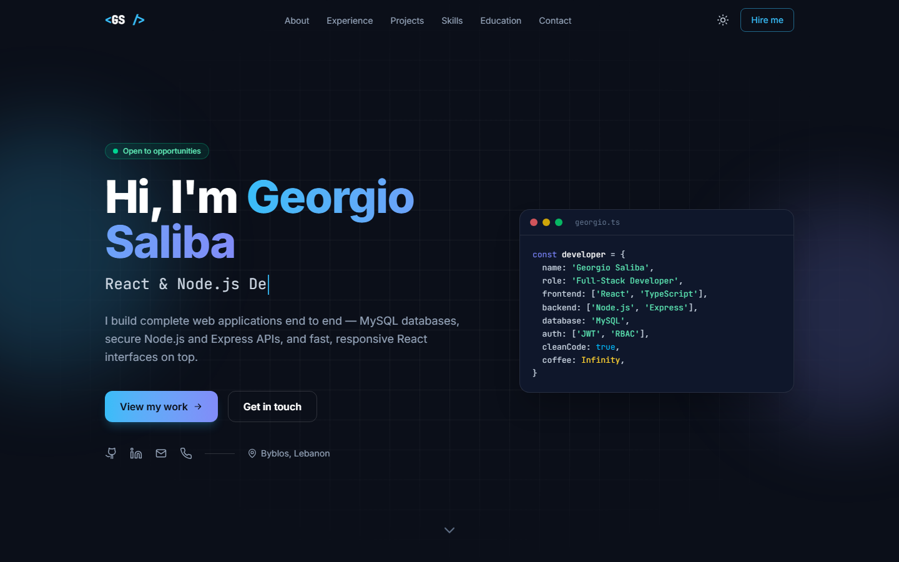
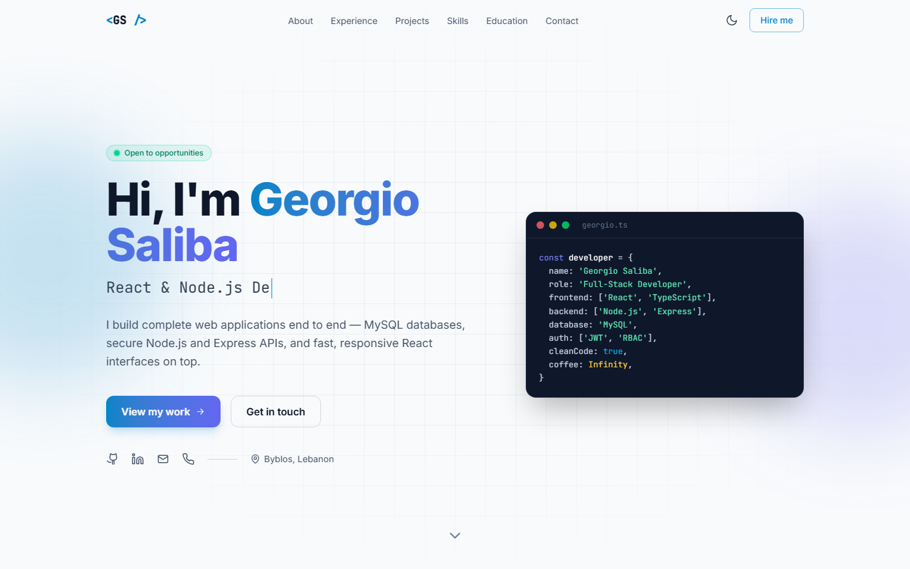

# Georgio Saliba — Portfolio

A personal portfolio landing page for **Georgio Saliba**, Full-Stack Developer (React · TypeScript · Node.js · Express · MySQL).

Built as a front-end only single page with React, Tailwind CSS and AOS scroll animations.



<details>
<summary>Light mode</summary>



</details>

## Features

- **Responsive layout:** designed for phone, tablet and desktop
- **Light / dark mode:** follows the system setting by default, remembers the visitor's choice, no flash on load
- **Scroll animations** with [AOS](https://michalsnik.github.io/aos/) (respects *prefers-reduced-motion*)
- **Sticky navbar** that highlights the section in view, with a mobile menu
- **Typewriter hero**, experience timeline, project cards, skills and languages
- **Single source of content:** all CV data lives in [`src/data/resume.js`](src/data/resume.js)

## Tech stack

| | |
|---|---|
| Framework | [React 19](https://react.dev) + [Vite](https://vite.dev) |
| Styling | [Tailwind CSS v4](https://tailwindcss.com) |
| Animations | [AOS](https://github.com/michalsnik/aos) |
| Linting | [oxlint](https://oxc.rs) |

## Getting started

Requires [Node.js](https://nodejs.org) 20 or newer.

```bash
git clone https://github.com/georgio30/georgio-saliba-portfolio.git
cd georgio-saliba-portfolio
npm install
npm run dev
```

Then open http://localhost:5173.

| Script | What it does |
|---|---|
| `npm run dev` | Start the dev server with hot reload |
| `npm run build` | Build for production into `dist/` |
| `npm run preview` | Preview the production build locally |
| `npm run lint` | Lint the code |

## Project structure

```
src/
├── App.jsx              # Page layout + AOS setup
├── index.css            # Tailwind theme tokens (light & dark)
├── data/resume.js       # All portfolio content
└── components/
    ├── Navbar.jsx       # Sticky nav, mobile menu, theme toggle
    ├── ThemeToggle.jsx
    ├── Hero.jsx
    ├── About.jsx
    ├── Experience.jsx
    ├── Projects.jsx
    ├── Skills.jsx
    ├── Education.jsx
    ├── Contact.jsx
    ├── Footer.jsx
    ├── SectionHeading.jsx
    └── Icons.jsx        # Inline SVG icon set
```

## Contact

- GitHub: [@georgio30](https://github.com/georgio30)
- LinkedIn: [Georgio Saliba](https://lb.linkedin.com/in/georgio-saliba-30265a2b4)
- Email: [georgiosaliba@hotmail.com](mailto:georgiosaliba@hotmail.com)
